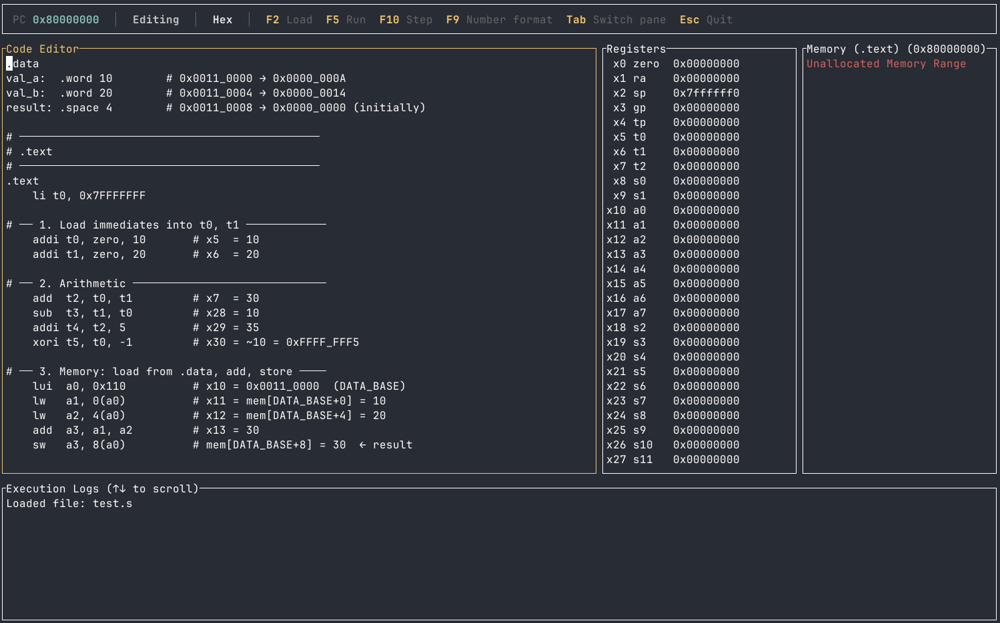

# ruscv

[](https://deepwiki.com/servomac/ruscv)

A RISC-V Assembler and Emulator implementation in Rust.

`ruscv` is a project aimed at providing a modular and extensible platform for assembling RISC-V assembly code and emulating its execution on an RV32I-compatible virtual processor.



## Features

- **Interactive TUI**: Real-time visualization of the processor state, memory, and logs.
- **Modular Pipeline**: Separate stages for lexing, parsing, pseudo-instruction expansion, symbol resolution, assembly, and execution.
- **RV32I Support**: Implements decoding and execution for the base integer instruction set, including:
  - Arithmetic and Logical operations (R-type and I-type).
  - Memory operations (Loads and Stores).
  - Control Flow (Branches, `JAL`, `JALR`).
  - Upper Immediate instructions (`LUI`, `AUIPC`).
- **Assembler**: Supports basic assembly syntax, labels, and a variety of directives for memory allocation and section management:
  - **Sections**: `.text`, `.data`
  - **Data**: `.byte`, `.half`, `.word`, `.ascii`, `.asciz`, `.string`, `.space`
  - **Alignment**: `.align`
  - **Modifiers**: `%hi(symbol)`, `%lo(symbol)`
- **ELF32 Loader**: Loads pre-compiled ELF32 binaries directly, mapping each `PT_LOAD` segment into the address space and resolving the `tohost` symbol for test pass/fail detection.
- **Headless ELF Runner**: Runs an ELF binary non-interactively from the command line, printing `PASS` or `FAIL` and exiting with the appropriate code — suitable for scripting and CI.
- **rv32ui Test Suite**: Passes all 40 `rv32ui-p` tests from the official RISC-V test suite (`make run-tests`).
- **Comprehensive Error Handling**: The assembler identifies and reports multiple errors across the source file instead of failing at the first encountered issue.
- **Unit Tested**: Extensively verified with a suite of unit tests for instruction encoding, decoding, and execution state transitions.

## Pending Features

- **Privileged ISA**: Full M-mode trap infrastructure — correct `mepc` save on trap entry, working `MRET`, `mstatus` (MIE/MPIE/MPP), `mscratch`, `mtval`. Currently only `mtvec` and `mcause` are tracked.
- **UART**: The UART device is registered but is a no-op stub; writes to THR are silently dropped.
- **CLINT Timer**: `mtime`/`mtimecmp` and timer-interrupt delivery are not yet implemented.

## Project Structure

- `src/tui.rs`: The interactive Terminal User Interface — UI state, key bindings, and rendering only.
- `src/session.rs`: Emulator session — owns the processor, debug info, register snapshots, and drives the assembler pipeline. Shared logic between the TUI and future headless use cases.
- `src/processor.rs`: The heart of the emulator, handling instruction fetch, decode, and execution.
- `src/elf_loader.rs`: ELF32 parser — maps PT_LOAD segments and resolves the `tohost` symbol.
- `src/runner.rs`: Headless ELF runner — steps the processor and detects pass/fail via `tohost`.
- `src/assembler.rs`: Converts instructions and data into binary segments.
- `src/symbols.rs`: Handles label definitions and address resolution.
- `src/parser.rs`: Parses tokens into abstract statements.
- `src/pseudo.rs`: Expands pseudo-instructions into base instructions.
- `src/lexer.rs`: Tokenizes assembly source into a stream of tokens.
- `src/config.rs`: Central configuration for memory base addresses and architectural constants.

## Usage

To start the interactive emulator, simply run:

```bash
cargo run
```

You can also pass an optional assembly file to be loaded directly into the editor:

```bash
cargo run -- path/to/file.asm
```

To run a pre-compiled ELF32 binary headlessly:

```bash
cargo run -- --elf path/to/binary.elf
# PASS  (exit code 0)
# FAIL (test case N)  (exit code 1)
```

### Controls

| Key | Action |
| --- | --- |
| **F5** | Assemble and Run to completion / Halted |
| **F2** | Assemble and Load (Reset CPU state) |
| **F10** | Assemble and Step one instruction |
| **F9** | Cycle Number Format (Hex, Binary, Decimal) |
| **Tab** | Cycle Focus (Editor, Registers, Memory, Logs) |
| **Arrows** | Edit code or Scroll focused pane |
| **T / D / S** | (In Memory pane) Jump to .text / .data / .stack |
| **C** | (In Memory pane) Jump to current PC |
| **Esc** | Quit application |

## Running Tests

To run the unit test suite:

```bash
cargo test
```

To run the official rv32ui-p RISC-V test suite (downloads pre-compiled binaries on first run):

```bash
make run-tests
```

## Contributing

This is an educational project exploring RISC-V architecture and Rust systems programming. Feel free to explore the code and run the existing tests to understand the implementation.

